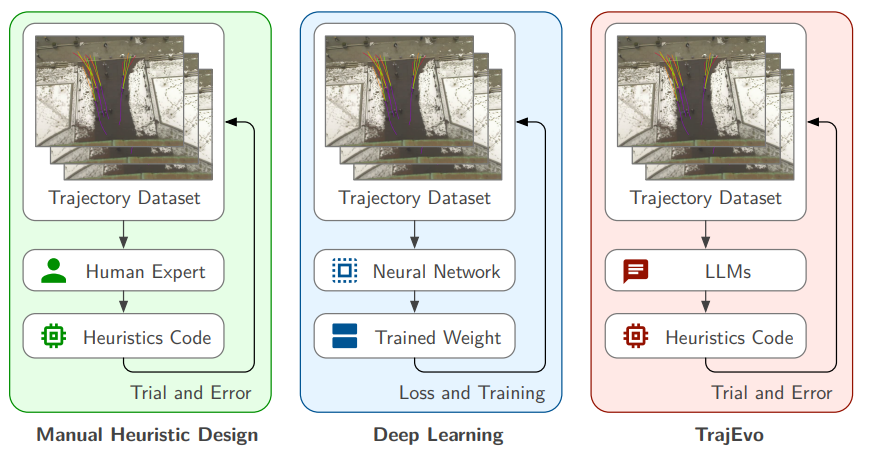
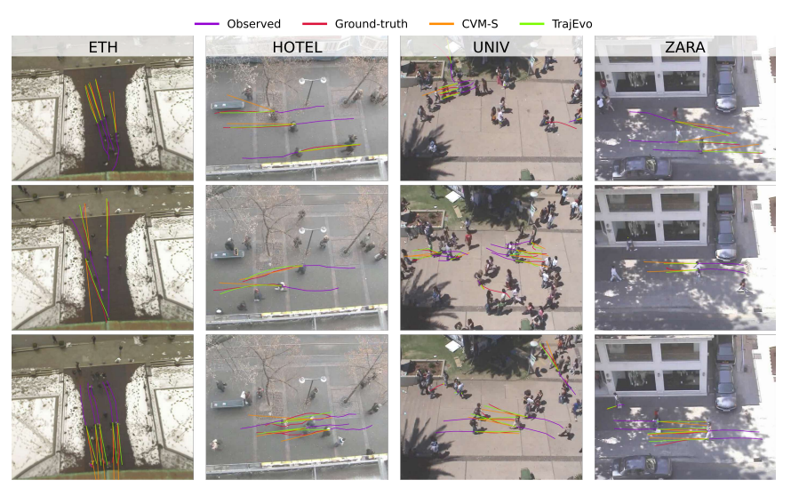

# TrajEvo

[](https://arxiv.org/abs/2505.04480) [](https://opensource.org/licenses/MIT)

_Evolving SOTA Trajectory Prediction Heuristics with LLMs_

<p align="center">
    
</p>


| Metric | Manual Heuristic Design | Deep Learning | TrajEvo |
| :----- | :-----------------------: | :-----------: | :-----: |
| Explainability | ✨ | ❌ | ✨ |
| Speed | ✨ | ⚠️ | ✨ |
| Performance (in-distribution) | ❌ | ✨  | ✅ |
| Performance (generalization) | ⚠️ | ⚠️  | ✨ |

Legend: ✨ (Excellent), ✅ (Good), ⚠️ (Often Poor), ❌ (Bad)


## Install

With uv:

```bash
uv venv --python 3.12
source .venv/bin/activate
uv sync --all-extras
```

You may check the available LLM clients in [`utils/llm_client`](utils/llm_client). Remember to set the environment variables for the LLM client you want to use. For example, to run the exp with VertexAI, remember to run `export GOOGLE_APPLICATION_CREDENTIALS="..."` with the json file.


### Usage

From the root directory, you may run:


```bash
python main.py problem=trajectory_prediction init_pop_size=8 max_fe=50 timeout=20 llm_client=vertexai problem.dataset=eth
```
Change `problem.dataset` to `eth`, `hotel`, `univ`, or `zara1` for different datasets. This means training on all datasets **except** ETH (i.e., it will generate the "ETH" results).


Note that the main problem files repo for trajectory prediction is here: [trajectory_prediction](trajectory_prediction)


---


### Train TrajEvo (run multiple experiments)

```bash
python main.py -m problem=trajectory_prediction init_pop_size=8 max_fe=50 timeout=20 llm_client=vertexai problem.dataset=eth,zara1,zara2,hotel,univ seed=0,1,2 wandb_name="trajevo_v1"
```

The above will run multiple (with `-m`) experiments, across all datasets, with different seeds.


### Evaluate TrajEvo 


#### ETH-UCY
```bash
# ETH
python trajectory_prediction/eval.py --code_path trajectory_prediction/trajevo/eth.py --code_function predict_trajectory --test --dataset eth

# Hotel
python trajectory_prediction/eval.py --code_path trajectory_prediction/trajevo/hotel.py --code_function predict_trajectory --test --dataset hotel

# Univ
python trajectory_prediction/eval.py --code_path trajectory_prediction/trajevo/univ.py --code_function predict_trajectory --test --dataset univ

# Zara1
python trajectory_prediction/eval.py --code_path trajectory_prediction/trajevo/zara1.py --code_function predict_trajectory --test --dataset zara1

# Zara2
python trajectory_prediction/eval.py --code_path trajectory_prediction/trajevo/zara2.py --code_function predict_trajectory --test --dataset zara2
```

This will evaluate TrajEvo held-out on each specific dataset.

#### SDD generalization

To evaluate the best heuristic found for the ETH split --> SDD generalization:
```bash
python trajectory_prediction/eval.py --code_path trajectory_prediction/trajevo/eth.py --code_function predict_trajectory --test --dataset sdd
```

You can substitute the `eth.py` with other heuristics found in the `trajectory_prediction/trajevo` folder to obtain other results. Note that this specific value should be multiplied by 100 to convert to original scale.

### Evaluate Heuristic Baselines

For CVM-S:
```bash
python trajectory_prediction/eval.py --code_path trajectory_prediction/baselines/cvm/model.py --code_args "{'sample':True}" --test --code_function predict_trajectory --dataset eth
```


You may just change the `code_path` and the sampling attribute to obtain other baselines:
- CVM: `--code_path trajectory_prediction/baselines/cvm/model.py --code_args "{'sample':False}"` 
- CVM-S: `--code_path trajectory_prediction/baselines/cvm/model.py --code_args "{'sample':True}"`
- ConstantAcc: `--code_path trajectory_prediction/baselines/constant_accel/model.py`
- CTRV: `--code_path trajectory_prediction/baselines/ctrv/model.py`
- CSCRCTR: `--code_path trajectory_prediction/baselines/cscrctr/model.py`
- SocialForce: `--code_path trajectory_prediction/baselines/socialforce/model.py`

As well as the `dataset` argument to evaluate on other datasets.

(Note: these results might be slightly different from what reported in the paper due to different random seed used at the time of writing)


<p align="center">
    
</p>


### Citation

If you find our work helpful (or if you are so kind as to offer us some encouragement), please consider giving us a star, and citing our paper:

```bibtex
@article{zhao2025trajevo,
  title={{TrajEvo}: Designing Trajectory Prediction Heuristics via LLM-driven Evolution},
  author={Zhikai Zhao and Chuanbo Hua and Federico Berto and Kanghoon Lee and Zihan Ma and Jiachen Li and Jinkyoo Park},
  journal={arXiv preprint arXiv:2505.04480},
  url={https://github.com/ai4co/trajevo},
  year={2025}
}
```


### Acknowledgements

Our work is built on top of the ReEvo repo! 
Please check it out:
https://github.com/ai4co/reevo
